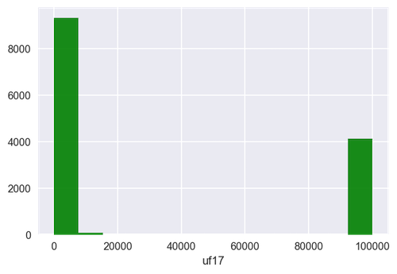
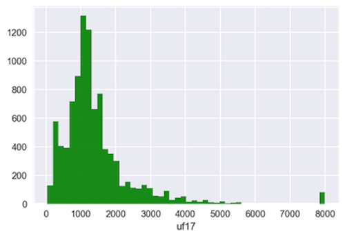
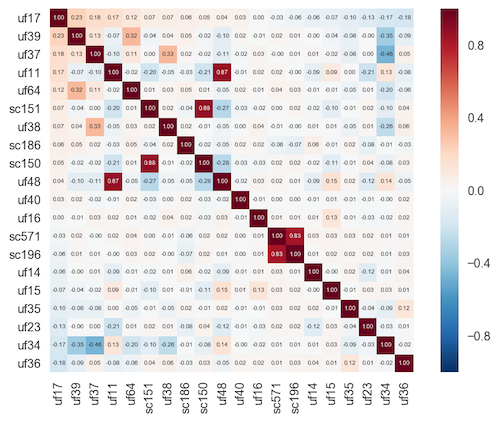
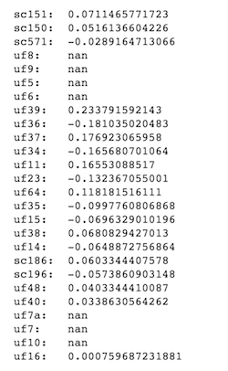
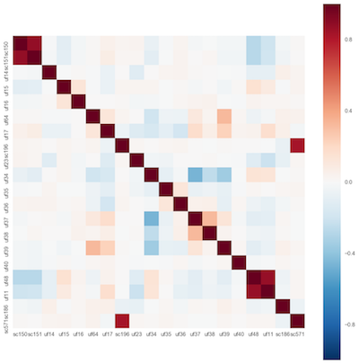

# Predicting rental prices in New York
  
---  
  
##### Keerti Agrawal - ka2601  
##### Janak A Jain - jaj2186  
  
---  

## Link  
  
Please [click here](https://github.com/AppliedMachineLearning/homework-ii-ka2601) to access the work on Keerti's GitHub.
  
## About  
  
This document explains the problem, dataset and modeling process followed by us to determine a model that can predict rental prices of apartments/houses in New York to a satisfactory degree of accuracy.  
  
---  
  
### Problem  
  
The problem given to us involves a real estate agent who wants to estimate the market rate of some apartments that just went into the market again. The data is available [here](https://www.census.gov/housing/nychvs/data/2014/uf_14_occ_web_b.txt).  
  
---  
  
### Dataset  
  
The dataset contains 15,342 observations with 197 features. The features are both categorical and continuous and relate to various information areas such as:  

* Condition of the:  
    - building  
    - neighborhood  
    - apartment/house  
* Costs:  
    - maintenance  
    - utilities, etc.  
* Householder:  
    - Age  
    - Race  
    - Family details  
* Apartment:  
    - Type  
    - Size, etc.  
  
The dataset is very comprehensive and covers a wide range of information areas. However, as can be understood, not every feature will be significant in predicting the rental values. Similarly, it is possible that some observations will not add to the discrimination quotient as they may contain a lot of ambiguous responses such "Not recorded".  
  
We have taken into consideration many such factors which are explained below on much more detail.  
  
---  
  
### Initial Preprocessing
  
We began by removing some insignificant rows which contain ambiguous reponses from the entire dataset.  
  
_**Process**_: We began by looking at each column (_feature_) in detail and checking if it contained ambiguous responses. We limited this cleaning step to only such columns that contained such responses. We then tagged the cells (observation,feature) for each column which contained the ambiguous values. Finally, we calculated the count of tags for each row (_observation_). By judgement, we decided to remove the rows with a count of tags more than two. This resulted in the removal of ~1700 rows.  
  
---  
  
### Exploratory Data Analysis  
  
#### 1. Plotting histogram of response variable and checking for outliers, if any  
  

  
The histogram given above shows that there are outliers (seen on the right hand side of the picture). These are the the values above 80000. We removed the rows from train and test dataset with values = 99999 of response variable to get a cleaner dataset. The resultant dataset was plotted which looks like the one below:  
  
  
  
  
#### 2. Splitting the features into Continuous & Categorical Features  
  
**Intuitively selecting features from record layout document and splitting them into continuous and categorical feature sets**  
  
**_Process_**: We inspected each feature individually and classified them into two groups:  

  * Categorical  
  * Continuous  

We split the data by columns based on whether they represented continuous or categorical variables. Since, the treatment differs across these classes, these intermittent datasets were extracted from the main data frame, preprocessed and then merged back before fitting the model.  
After splitting the dataset, we performed the following intermittent operations, we treated these two sub-datasets differently as follows:  
  
##### Continuous variables  
  
Firstly, we replaced some of the values to convert the features to continuous scale. Then, we plotted the correlation matrix of the features with the response variable to understand their correlation the response variable. We obtained the following graph:  
  
  
  
We noticed that there are a few features with very low correlations and some with "NA" values.  
  

  
  
We removed such values following which, the resultant graph looked like this:  
  
  
  
##### Categorical variables  

We replaced some of the values like 8 or 9 which were mostly meant - no response received - to 0 or nan etc. And few other values to make more sense of the data.

We also performed the following operations on the dataset.  
  
1. **Merging of semantically similar response codes**: Some questions contained semantically similar responses such as "No, but ... ", "No, and ... ". Such options, only after manual inspection, were carefully marked. In these questions, the semantically similar responses were given the same response code so that it is easier for the model to learn a more strongly categorical question.

2. **Removal of redundant information**: Certain questions either captured the same information twice or in a different manner. For example, the question regarding householder's race was captured twice with different levels of detail. In such cases we have included only one of the two questions to keep the model leaner. Decision regarding inclusion of the question was based on judgement.

3. **Removal of directly related variables**: We have tried to keep the model as relevant to the posed problem as possible. In real world scenarios for example, it is not possible or is at least difficult to extract, information related directly to the rent, such as "exact construction year". As a result, we have tweaked the model to reflect these constraints.  
  
##### Imputation, Dummy Variables and Scaling

Then we looked at all the NaN values in all the rows, stored them into a file and imputed seperately for categorical and continuous variables with most-frequent ocuuring values in categorical. In categorical, we added dummy variables afterwards. And scled continuous variables.
  
After all this feature engineering and scaling, we combined continuous and categorical variables to one dataframe. From this dataframe, we created response variable and independent variable seperately to split them and train them.  
  
---

  
### Modeling  
  
**Model**: We were restricted to use linear models for this exercise. We fit the data using Lasso regression (_LassoCV_) as it chooses the best K and alpha for the model.

**Accuracy**: The model returns an accuracy of **54.73%** which is above the expected baseline we considered which is 50%. We are also returning three numpy arrays as asked in the question X_test, y_test and y_pred.

